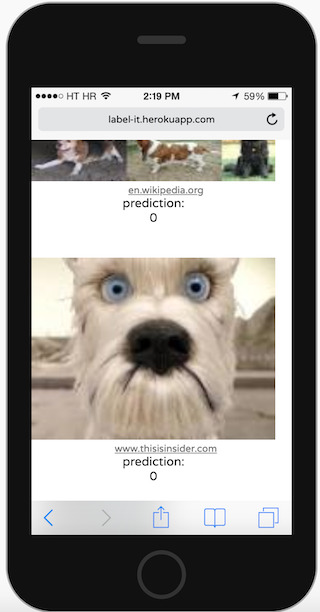

# labelit

<a href="https://label-it.herokuapp.com/?github"></a>

An app for labeling images to train your very own image classifier model in the browser.  It uses https://github.com/kevinrobinson/services-edu/ to let you test out on different image searches.

## Demo
https://label-it.herokuapp.com/

#### Labeling


#### Training


#### Trying it out!





## Development
To develop locally:
```
$ yarn install
$ yarn start
```

This will run the server and the create-react-app development server in parallel, writing the output of both to stdout.

Note that the site is responsive and will include a fake frame for an iPhone 5 running Safari at desktop resolution.

Running `yarn storybook` separately will also start a [storybook](https://github.com/storybooks/storybook) server on port 9001.  You can use this to create "stories" iterate on UI features.

This project was adapted from https://github.com/mit-teaching-systems-lab/groupdate


### To run tests:
```
$ yarn test
```

You can also run the linter and tests independently for the server or client code, see `package.json` for commands.
